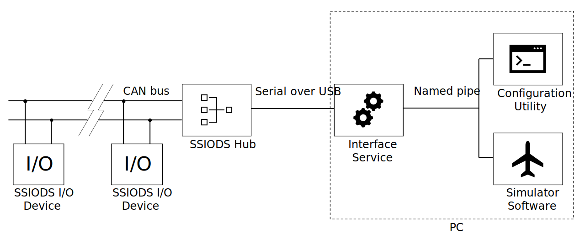

# Stellar Simulator Input / Output Device Standard V0.1 (SSIODS V0.1)

## (1) Background

(1.1) This standard documents requirements and guidelines for design of devices that operate as part of a hardware package of a simulator or another plant. In this context, simulators and plants are various vehicle physics simulators (flight simulators, driving simulators, boating simulators, etc). Hardware inputs for these simulators include devices like buttons, knobs, joysticks/yokes, pedals, etc. Hardware outputs include devices like indicators (attitude indicator, altimeter, speedmeter, etc), process/warning lights, screens, etc.

## (2) System Architecture

(2.1) The system consists of one or more SSIODS I/O devices, one or more SSIODS hubs networked via CAN bus, and SSIODS-compatible software running on a computer. The hub is used to forward messages from the PC running the simulator to the devices, from devices to the PC, and between devices when devices are spread across multiple CAN busses (which could be implmented as a single hub with multiple CAN busses, multiple hubs, or some combination). The SSIODS-compatible computer software can take multiple forms, such as configuration utility programs, services, or simulator plugins. The computer software must implement the SSIODS Serial communication protocol to communicate with the SSIODS hubs. This standard specifies device requirements, CAN bus communication requirements, hub requirements, and serial over USB communication protocol.

## (3) SSIODS CAN Bus Communication

(3.1) Devices and hubs participating in a SSIODS arrangement must implement CAN bus ISO 11898-2 standard (1 Mbit/s linear/daisy chain network arrangement with 120 Ohm terminating resistors) and handle 1Mbit/s network traffic. SSIODS hubs, as a CAN bus termination point, must contain a 120 Ohm terminating resistor. SSIODS device must contain an optional 120 Ohm terminating resistor with means to add and remove it from the circuit, such as a jumper or a switch.

(3.2) Manufacturers may use the 00000000000 through 11101111111 message ID range for application specific messages. It is up to the manufacturer of an SSIODS device to ensure that the device's message IDs are unique and do not collide with other devices' messages. It is recommended to allow the reconfiguration of message IDs on devices.

### (3.A) Reserved CAN Messages

(3.A.1) This section contains CAN messages that are reserved for SSIODS commands. These commands are emitted by hubs and are received by I/O devices. A compliant SSIODS device must be able to handle these messages.

#### (3.A.A) 11111111111 - Activate

(3.A.A.1) The **Activate** message is used to transition one device or all devices from STANDBY to ACTIVE state.

(3.A.A.2) Payload: 16 bit integer ID of target device (corresponding to device's status message ID), or 0 to target all devices on the bus.

#### (3.A.B) 11111111110 - Standby

(3.A.B.1) The **Standby** message is used to transition one device or all devices from ACTIVE to STANDBY state.

(3.A.B.2) Payload: 16 bit integer ID of target device (corresponding to device's status message ID), or 0 to target all devices on the bus.

#### (3.A.C) 11111111101 - Enter Configuration Mode

(3.A.C.1) The **Enter Configuration Mode** message is used to transition one device from STANDBY to CONFIGURING state.

(3.A.C.2) Payload: 16 bit integer ID of target device (corresponding to device's status message ID).

#### (3.A.D) 11111111100 - Exit Configuration Mode

(3.A.D.1) The **Exit Configuration Mode** message is used to transition one device from CONFIGURING to STANDBY state.

(3.A.D.2) Payload: 16 bit integer ID of target device (corresponding to device's status message ID).

#### (3.A.E) 11111111011 - Visual Identify

(3.A.E.1) The **Visual Identify** message is used to temporarily set the device into a VISUAL_ID state.

(3.A.E.2) Payload: 16 bit integer ID of target device (corresponding to device's status message ID).

#### (3.A.F) 11111100000 through 11111111010 - Reserved for future SSIODS commands

(3.A.F.1) This message ID range is reserved for future commands.

### (3.B) Special CAN Messages

#### (3.B.A) 11110000000 through 11111011111 - Device status message

(3.B.A.1) This message ID range is used for device status updates. Each SSIODS device on a particular SSIODS CAN bus must periodically transmit a status message using a unique message ID in this range. The device status messages are used to identify devices present on a SSIODS CAN bus and to communicate the SSIODS device state.

(3.B.A.2) Payload: 1 byte. Last (least significant) two bits contain the SSIODS device state. (00) - STANDBY, (01) - ACTIVE, (10) - CONFIGURING.

## (4) SSIODS Serial Communication

(4.1) 

### (4.A) Serial Message Format

(4.A.1) The messages are framed and contain a checksum. A frame consists of a frame start byte (0xF0), the set of data bytes that make up the message, a checksum byte, and a frame end byte (0xF1). An escape byte (0xF2) is used to escape framing bytes (start byte, end byte, and escape byte).

(4.A.2) Example of a framed message: |SB|DD|DD|DD|DD|DD|DD|ES|SB|DD|DD|DD|DD|DD|DD|CS|EB|

(4.A.3) In the above example, SB is the start byte used for framing, EB is the end byte used for framing, ES is the escape byte used for escaping framing bytes, and DD is an arbitrary data byte.

### (4.B) Hub Serial Message Types

(4.B.1) SSIODS messages are serialized using Protocol Buffers (Protobuf) format. The two base message types are HubBound and PcBound. HubBound messages are transmitted from PC software to an SSIODS hub and PcBound messages are transmitted from an SSIODS hub to the PC software. Both message types contains an id (64 bit unsigned int) that can be used for acknowledging message reception.